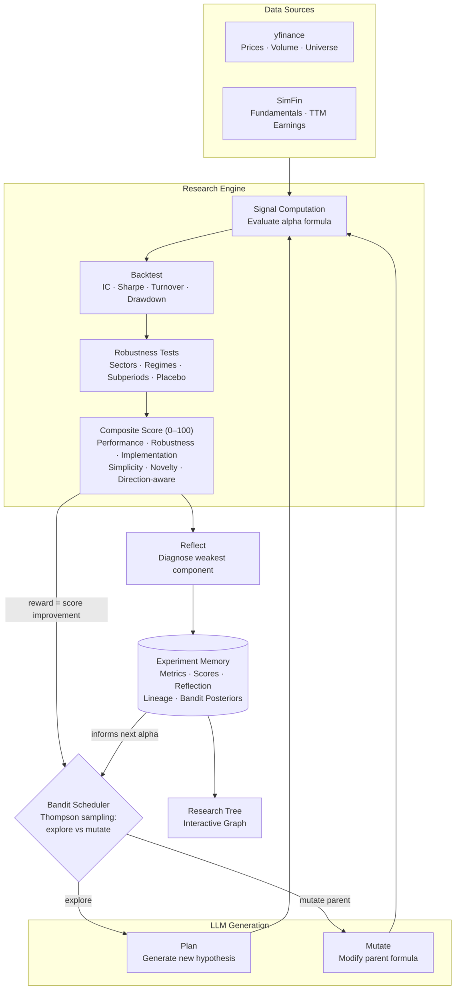

# AlphaResearchBot

An agentic system for autonomous quantitative alpha research on US equities.

## Motivation

1. Quantitative alpha research is fundamentally an **iterative process**: form a hypothesis, build a signal, backtest it, diagnose why it failed, and try again. In practice this loop is slow and manual. A researcher might spend days writing a signal, running a backtest, and interpreting the output — only to discover the alpha had excessive turnover or an inconsistent IC across sectors. Then they start over.

2. The **search space is enormous**, and most signals are dead ends. A researcher might try hundreds of combinations of features, weights, and rebalance frequencies before finding a signal that works. By storing every experiment and its verdict, the system can avoid re-testing near-duplicate alphas, learn which types of signals fail in which ways, and generate next steps that are grounded in evidence rather than intuition alone.

The core insight behind this project is that most of that loop can be automated. The hypothesis-to-verdict pipeline is well-defined enough to codify, and the "what went wrong and what should I try next" question is exactly the kind of reasoning that LLMs are good at. If you can close the loop — so that a failed experiment automatically informs the next one — you get a research process that compounds on itself rather than restarting from scratch each time.

AlphaResearchBot is a proof of concept for that idea. It maintains a persistent memory of every experiment it has run, uses an LLM to reflect on failures and propose new directions, and tracks the full lineage of hypotheses as a tree so you can see how ideas evolved. The goal is not to replace the researcher, but to handle the mechanical parts of the loop so the researcher can focus on the ideas themselves.

## The Research Loop

The system runs a closed cycle:

1. **Schedule** — a Thompson-sampling bandit decides whether to explore a new research direction or mutate an existing alpha, learning from the reward of every past decision
2. **Hypothesize** — define an investment thesis and express it as a formula over financial features (e.g. `rank(EBITDA_MARGIN) + rank(MOM12_1)`)
3. **Backtest** — run a monthly-rebalanced long-short backtest on S&P 500 data, measuring IC, Sharpe, turnover, and drawdown
4. **Stress-test** — check whether the signal holds across sectors, market regimes, and subperiods, and whether it survives a placebo test
5. **Score** — compute a continuous composite score (0–100) over five dimensions: predictive performance, robustness, implementability, **formula simplicity**, and **novelty** vs. everything tried before. The verdict (`promising` / `revise` / `failed`) falls out of score bands rather than hard cliffs, so the LLM can't game individual thresholds with ever-more-complex formulas. Scoring is direction-aware: alongside the raw score it computes a **predictive magnitude** (direction-blind) and a **direction status** (`supported` / `contradicted` / `uncertain`), so a signal whose hypothesis was backwards is recorded as contradicted — kept as a research lead rather than discarded, and never re-tested as a redundant sign flip
6. **Reflect** — ask an LLM to diagnose the weakest score component and identify what specifically to change
7. **Evolve** — either plan a new branch of research based on the full experiment history, or mutate an alpha to address its specific weakness
8. **Remember** — store everything (metrics, score, reflection, lineage, bandit posteriors) so future experiments can learn from it

Each experiment links back to its parent, building a research tree over time. This means you can trace exactly why an alpha exists and what it was trying to fix.



## Alpha Evolution Graph

Each run is a node in a growing research tree. Failed experiments are mutated into children that address the specific failure mode, while promising ones branch into new directions.

Clicking any node opens a side panel with the composite score and three tiers of diagnostics:
- Composite Score — the score out of 100, the predictive magnitude, a "direction contradicted" badge when the signal ran opposite to its hypothesis, and the five sub-scores (performance / implementation / robustness / simplicity / novelty) color-coded green/amber/red
- Tier 1 — Predictive Power: IC mean, ICIR, monotonicity
- Tier 2 — Implementation: Sharpe, Q5-Q1 return, turnover, max drawdown
- Tier 3 — Diagnostics: IC by industry (top 4 sectors), subperiod stability, market regime Sharpe (bull/bear/high_vol/low_vol), and placebo score
- LLM generated reflection: observation, failure reason, possible explanation, next mutation

Below is a sample graph of a few experiments, node color indicates verdict: red = failed, orange = revise, green = promising.


## Why This Matters

Most backtesting tools treat each experiment as independent. You run a signal, get a number, move on. There's no memory of what you've already tried, no systematic diagnosis of failures, and no mechanism to ensure the next experiment is meaningfully different from the last. Researchers end up rediscovering the same dead ends.

By giving the system a persistent experiment store and LLM-powered planning, AlphaResearchBot can avoid re-testing near-duplicate alphas, learn which types of signals fail in which ways, and generate next steps that are grounded in evidence rather than intuition alone.

## Roadmap

The project is built in stages, each proving a different capability:

| Version   | Goal                                                                                                              |
|-----------|-------------------------------------------------------------------------------------------------------------------|
| V1        | Prove the architecture with a fully mock pipeline                                                                 |
| V2        | Replace mocks with real market data (yfinance, SimFin) and a real backtest engine                                 |
| V3        | Add real LLM reflection, a research planner, and a full agentic loop                                              |
| V3.5      | Add alpha mutation and an interactive research graph                                                              |
| V3.9      | Ring layout with batch tracking, LLM formula self-correction, robustness diagnostics in graph                     |
| V4        | Autonomous loop with Bandit scheduler; Objective re-design (rewarding formula simplicity rather than Sharpe only) |
| V5 (Plan) | MCP integration, Validation on LLM-generated reflection                                                           |                 


## Quickstart

```bash
# Set up
python -m venv .venv && source .venv/bin/activate
pip install -r requirements.txt

# Run the autonomous research loop — the bandit decides explore vs mutate
python scripts/run_loop.py --iterations 10

# Visualize the full research tree
python scripts/export_graph.py && open reports/research_graph.html

# Or drive the loop manually, exactly as before:

# Run a single experiment
python scripts/run_experiment.py --config experiments/sample_alpha_001.json

# Let the system plan what to try next
python scripts/plan_next.py --n 3 --save

# Mutate an experiment
python scripts/mutate_alpha.py --parent alpha_001 --run

```

See [COMMANDS.md](COMMANDS.md) for full usage, config options, and supported alpha features. See [CODEBASE.md](CODEBASE.md) for a per-module reference.
